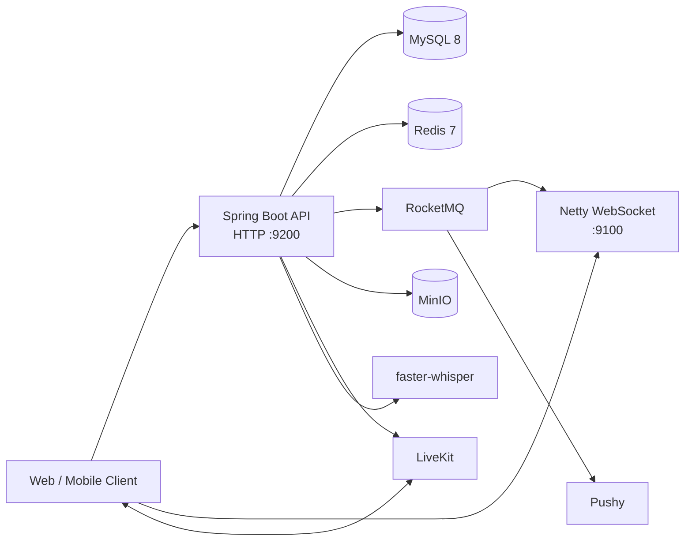

# Chat Server

一个面向实时互动场景的综合型 Java 服务端项目。

项目以即时通信为核心，整合好友与群组、社交动态、文件云盘、音视频通话、直播房间、实时弹幕、AI 对话和管理后台等能力，重点体现实时通信、异步解耦、缓存设计、对象存储、第三方服务集成、安全控制和容器化部署能力。

## 项目简介

Chat Server 在一个统一的业务域中实现了多类后端场景：

- 即时通信：好友私聊、群聊、消息记录、撤回、会话列表、未读通知和离线推送。
- 用户与权限：注册登录、邮箱验证、密码找回、二维码登录、用户设置和管理员管理。
- 社交互动：动态发布、评论、点赞、可见范围和通知。
- 云盘文件：个人空间、文件管理、Hash 检查、分片上传、断点续传、回收站和文件去重。
- 音视频与直播：视频通话信令、LiveKit 群组通话、直播房间、房间成员和弹幕。
- AI 与语音：AI 模型管理、同步问答、SSE 流式问答和语音转文字。

## 技术栈

| 领域 | 技术 | 主要用途 |
| --- | --- | --- |
| 运行时 | Java 17 | 应用运行环境 |
| Web 服务 | Spring Boot 3.5.7、Spring MVC | REST API、参数校验和依赖管理 |
| 实时通信 | Netty 4.2.10、WebSocket | 长连接、在线状态、消息和通话信令 |
| 数据访问 | MyBatis-Plus 3.5.16 | 数据持久化、条件查询和分页 |
| 数据库 | MySQL 8.0 | 业务数据持久化 |
| 缓存与临时状态 | Redis 7.0 | 高频关系判断、验证码、二维码、分片和弹幕 |
| 消息队列 | Apache RocketMQ 5.3.0 | 消息异步投递、邮件和消费解耦 |
| 离线推送 | Pushy | WebSocket 不可达时的移动端通知 |
| 对象存储 | MinIO | 图片、头像、语音、直播背景和文件 |
| 实时媒体 | LiveKit | 音视频房间、Token 和房间数据广播 |
| 语音识别 | faster-whisper server | 语音消息转文字 |
| 安全 | JWT、BCrypt、AES、RSA、HMAC-SHA256 | 身份、密码、敏感数据和第三方调用安全 |
| 部署 | Docker、Docker Compose、Maven | 构建和多服务编排 |

### 当前代码规模

以下为当前代码库的实现规模快照：

| 组成 | 数量 | 说明 |
| --- | ---: | --- |
| Java 源文件 | 336 | 业务、配置、工具、消费者和实时通信代码 |
| 用户端 Controller | 24 | 用户、好友、群组、消息、云盘、直播和 AI 等接口 |
| 管理端 Controller | 6 | 用户、通知、统计和第三方接口 |
| Service / ServiceImpl | 62 / 28 | 业务编排、事务、缓存和外部服务适配 |
| Entity | 27 | 主要业务领域数据模型 |
| VO / DTO | 81 / 35 | 接口参数和业务传输对象 |
| Mapper XML | 18 | 复杂查询、聚合和统计 |
| MQ Consumer | 3 | 用户消息、群消息和邮件消费者 |

## 系统架构



项目采用 Controller - Service - Mapper - Entity 分层，并使用 VO、DTO 区分接口参数、业务对象和返回数据。Redis、RocketMQ、WebSocket、MinIO 和 LiveKit 作为独立基础设施，由 Service 层统一编排。

## 核心功能

### 即时通信

- 支持用户私聊、群聊以及文本、图片、文件、语音等消息类型。
- 支持消息历史、倒序分页、会话列表、未读数、消息撤回和撤回内容恢复。
- 发送消息前校验好友关系、群成员身份、禁言状态和群是否解散。
- 通过 WebSocket 实时通知在线用户，通过 Pushy 通知离线用户。
- 支持视频通话邀请、接受、Offer、Answer、Candidate 和挂断信令。

### 用户、好友与群组

- 注册、登录、邮箱验证码、邮箱验证、找回密码和二维码登录。
- 用户资料、头像、聊天背景和个人设置。
- 好友申请、同意/拒绝、备注、分组、特别关注和删除好友。
- 群组创建、更新、邀请、退出、踢人、群主转让、解散和群公告。
- 群成员查询、分页、禁言和群头像管理。
- 管理员用户管理、账号禁用/解禁、角色设置和系统通知。

### 社交动态

- 动态发布、列表、详情和删除。
- 动态评论、点赞以及相关列表查询。
- 动态可见范围和权限配置。
- 动态图片上传和对象存储。

### 云盘与文件

- 用户个人空间、文件列表、下载、删除和分类统计。
- 文件回收站、恢复、删除和清理。
- 通过文件 Hash 检查已存在文件，支持文件复用。
- 通过 Redis 记录上传分片，支持断点续传和缺失分片补传。
- 使用流式方式合并分片并上传 MinIO，避免大文件整体进入内存。
- 使用逻辑文件与物理文件分离的模型支持文件去重。

### 音视频、直播与 AI

- LiveKit 群组通话和直播房间 Token。
- 直播开播、房间信息、房间成员、标题和背景图。
- Redis 保存弹幕历史，LiveKit Data 频道广播实时弹幕。
- AI 模型配置、同步问答和 SSE 流式问答。
- 通过最近对话记录提供短期上下文记忆。
- 通过 faster-whisper 服务完成语音转文字。

## 中间件与实时能力

### 消息投递链路：RocketMQ + WebSocket + Pushy

这三个组件共同实现完整的消息送达能力：RocketMQ 负责异步解耦，WebSocket 负责在线实时推送，Pushy 负责离线兜底。

```text
消息发送
  → 消息和会话写入 MySQL
  → RocketMQ 异步投递
  → Consumer 消费
  → WebSocket 推送在线用户
  → Channel 不可用时转 Pushy 离线推送
```

私聊和群聊分别使用不同的消息消费者。群聊会根据群成员列表进行广播，并收集 WebSocket 发送失败的用户后统一执行离线推送。邮件也通过 RocketMQ 异步发送，避免邮件服务影响主请求。

当 MQ 未启用或投递失败时，业务层会直接尝试 WebSocket，仍然失败后再使用 Pushy，形成消息队列故障时的降级路径。

RocketMQ 当前使用统一的 `chat` Topic，通过 `user`、`group`、`email` 区分用户消息、群消息和邮件任务，并封装同步、异步、延时和单向发送方式。

代码位置：

- 消息业务：[`MessageServiceImpl.java`](src/main/java/com/example/chatserver/service/impl/MessageServiceImpl.java)
- MQ 生产者：[`MQProducerService.java`](src/main/java/com/example/chatserver/service/MQProducerService.java)
- MQ 消费者：[`consumer`](src/main/java/com/example/chatserver/consumer)
- WebSocket 推送：[`WebSocketService.java`](src/main/java/com/example/chatserver/websocket/WebSocketService.java)

### Netty WebSocket

项目单独使用 Netty 启动 WebSocket 服务，监听 `9100` 端口，路径为 `/ws`；REST API 由 Spring Boot 监听 `9200` 端口。

WebSocket 主要实现：

- 连接建立后的 JWT 认证和账号状态检查。
- 在线用户与 Channel 的双向索引。
- 同账号多端登录时保留最新连接并通知旧连接下线。
- 30 秒读空闲检测、连接断开、异常关闭和在线状态清理。
- 普通消息、通知、视频信令、通话、系统通知和账号禁用等多种推送类型。

当前 Netty Handler 负责连接生命周期，消息业务由 HTTP API 和 MQ Consumer 通过 `WebSocketService` 主动推送，保持网络层和业务层分离。

代码位置：[`NettyWebSocketServer.java`](src/main/java/com/example/chatserver/websocket/NettyWebSocketServer.java)、[`NettyWebSocketServerHandler.java`](src/main/java/com/example/chatserver/websocket/NettyWebSocketServerHandler.java)、[`WebSocketService.java`](src/main/java/com/example/chatserver/websocket/WebSocketService.java)。

### Redis

Redis 在项目中同时承担缓存、临时状态和短期数据存储：

- 缓存用户资料、好友关系、好友详情、群成员、禁言和群解散状态，减少高频数据库查询。
- 保存邮箱验证码、二维码登录状态等有时效性的业务数据。
- 保存在线人数、文件预览地址和直播间近期弹幕。
- 以 Set 记录文件已上传分片，支撑断点续传。
- 通过 TTL 管理验证码、缓存、分片和弹幕等数据生命周期。
- 通过统一的 `RedisUtils` 封装 String、Hash、Set、List、计数和过期操作。

业务数据更新后会删除相关缓存；缓存未命中时从 MySQL 回源并重新写入。Redis 在这里不仅是读缓存，也参与了文件上传和直播弹幕等业务状态管理。

代码位置：[`RedisUtils.java`](src/main/java/com/example/chatserver/utils/RedisUtils.java)、[`ChunkUploadUtil.java`](src/main/java/com/example/chatserver/utils/ChunkUploadUtil.java)、[`LiveRoomServiceImpl.java`](src/main/java/com/example/chatserver/service/impl/LiveRoomServiceImpl.java)。

### LiveKit

项目将音视频媒体传输交给 LiveKit，Chat Server 负责业务身份、房间权限和 Token：

- 为群通话、主播和观众签发不同权限的 Token，控制加入、发布和订阅能力。
- 使用 `group_{groupId}` 和 `live_{userId}` 区分群通话房间与直播房间。
- 查询活跃直播房间和房间参与者，并将 LiveKit identity 映射到本地用户资料。
- 通过 LiveKit RoomService 发送弹幕数据、查询房间和查询参与者。
- 使用 `danmaku` topic 广播可靠弹幕数据，Redis 同时保存弹幕历史。
- 对 LiveKit 服务调用设置超时、错误处理和参与者查询重试。

这种设计让 Java 服务负责鉴权和业务数据，让 LiveKit 负责高带宽、低延迟的媒体传输。

代码位置：[`LiveKitTokenServiceImpl.java`](src/main/java/com/example/chatserver/service/impl/LiveKitTokenServiceImpl.java)、[`LiveRoomServiceImpl.java`](src/main/java/com/example/chatserver/service/impl/LiveRoomServiceImpl.java)、[`VoipController.java`](src/main/java/com/example/chatserver/controller/VoipController.java)。

## 横切能力：认证、注解与数据注入

项目通过 Filter、注解、参数解析器、启动扫描器和 MVC Interceptor 实现统一的横切处理。当前没有直接使用 Spring `@Aspect`，但实现了切面式的认证、权限和数据注入能力。

### 用户信息自动注入

`AuthenticationTokenFilter` 在请求到达 Controller 前解析 `x-token` 中的 JWT，校验 Token、角色和账号状态，并将 Claims 写入请求属性 `userinfo`。

`UserInfoArgumentResolver` 将请求属性转换为 Controller 参数，支持：

- `@UserInfo`：注入完整用户信息。
- `@Userid`：注入当前用户 ID。
- `@UserRole`：注入当前用户角色。
- `@UserIp`：注入客户端 IP。

业务接口可以直接使用 `@Userid String userId`，不需要重复解析 Token，也不需要信任前端传入的用户 ID。

### 免验证 URL 与角色资源

接口使用 `@UrlFree` 标记登录、注册、验证码等公开接口，使用 `@UrlResource("admin")` 标记管理员资源。应用启动时，`UrlPassRunner` 从 Spring MVC 的接口映射中扫描这些注解，自动收集免验证 URL、角色 URL 和路径参数规则，并交给 `UrlPermitUtil` 使用。

这样可以避免在过滤器或配置文件中维护大量硬编码 URL，同时支持公开接口携带合法 Token 时继续注入用户信息。

### 第三方接口签名

`/v1/api/expose/**` 使用独立的 HMAC-SHA256 签名机制，通过 `X-Access-Key`、`X-Timestamp` 和 `X-Signature` 验证调用方，并在验证成功后注入调用方用户信息。时间戳校验用于降低重放风险。

代码位置：[`AuthenticationTokenFilter.java`](src/main/java/com/example/chatserver/filter/AuthenticationTokenFilter.java)、[`UserInfoArgumentResolver.java`](src/main/java/com/example/chatserver/config/UserInfoArgumentResolver.java)、[`UrlPassRunner.java`](src/main/java/com/example/chatserver/runner/UrlPassRunner.java)、[`SignatureInterceptor.java`](src/main/java/com/example/chatserver/interceptor/SignatureInterceptor.java)。

## 关键业务实现方式

### 消息

消息先进行好友/群权限校验并写入 MySQL，再更新会话列表，之后进入“RocketMQ 异步投递 → WebSocket 在线推送 → Pushy 离线兜底”的统一链路。

### 云盘

使用文件 Hash 判断是否可以复用已有物理文件；新文件按分片上传，Redis 记录上传状态，服务端合并后上传 MinIO，并通过逻辑文件与物理文件分离支持回收站和去重。

### 直播弹幕

服务端验证直播会话和用户身份，将弹幕保存到 Redis，同时通过 LiveKit 房间数据广播；新进入房间的用户通过历史接口获取之前的弹幕。

### AI 流式问答

服务端读取最近对话作为短期上下文，通过 `SseEmitter` 持续发送 `delta` 事件，回答完成后保存记录并发送 `done`，异常时发送 `error`。

## 数据模型

数据库初始化脚本：[`chat.sql`](chat.sql)

| 领域 | 数据表 |
| --- | --- |
| 用户与配置 | `user`、`user_set`、`user_operated` |
| 好友与通知 | `friend`、`notify` |
| 会话与消息 | `conversation`、`chat_list`、`message`、`message_retraction` |
| 群组 | `chat_group`、`chat_group_member`、`chat_group_notice` |
| 社交动态 | `talk`、`talk_comment`、`talk_like`、`talk_permission` |
| 直播与 AI | `live_room`、`ai_model`、`ai_chat_record` |
| 云盘 | `space`、`space_file`、`space_recycle`、`physical_file` |
| 其他 | `emoji`、`statistic` |

## 安全设计

- JWT 使用 HS256 签名，默认有效期 30 天。
- 用户密码使用 BCrypt 处理。
- 安全密钥通过配置或环境变量注入。
- 第三方接口使用 HMAC 签名并校验时间戳。
- 消息、群组、文件和管理员操作均包含业务权限校验。
- 用户被禁用后，既不能建立新的 WebSocket 连接，也会被主动关闭已有连接。

## 部署与运行

### Docker Compose

项目通过 Docker Compose 编排以下服务：

- `chat`：Spring Boot 业务服务。
- `mysql`：业务数据库并初始化 `chat.sql`。
- `redis`：缓存和临时状态。
- `minio`：对象存储。
- `namesrv`、`broker`：RocketMQ。
- `livekit`：音视频与房间服务。
- `whisper`：语音识别服务。

```bash
cd deploy/compose
docker compose up -d --build
docker compose ps
docker compose logs -f chat
```

停止服务：

```bash
docker compose down
```

### 本地构建

```bash
./mvnw test
./mvnw -DskipTests package
```

Windows：

```powershell
.\mvnw.cmd test
.\mvnw.cmd -DskipTests package
```

主要配置文件：[`application-docker.yml`](src/main/resources/application-docker.yml)。数据库、Redis、MinIO、RocketMQ、LiveKit、邮件、JWT 和 AES 等敏感配置通过环境变量注入。

## 服务端口

| 端口 | 服务 |
| --- | --- |
| `9200` | Spring Boot HTTP API |
| `9100` | Netty WebSocket，路径 `/ws` |
| `3306` | MySQL |
| `6379` | Redis |
| `8000` | faster-whisper |
| `9000 / 9001` | MinIO API / Console |
| `9876` | RocketMQ NameServer |
| `10909 / 10911 / 10912` | RocketMQ Broker |
| `7880 / 7881` | LiveKit |
| `50000-50100/udp` | LiveKit WebRTC 媒体端口 |

## 项目结构

```text
chat-server/
├─ pom.xml                  Maven 依赖和构建配置
├─ Dockerfile               多阶段镜像构建
├─ chat.sql                 数据库初始化脚本
├─ deploy/compose/          MySQL、Redis、MQ、MinIO、LiveKit 等编排
├─ docs/                    接口和项目说明
└─ src/
   ├─ main/java/com/example/chatserver/
   │  ├─ admin/              管理端接口和对象
   │  ├─ annotation/         用户、URL 放行和资源权限注解
   │  ├─ config/             Spring、MinIO、LiveKit、AI 等配置
   │  ├─ consumer/           RocketMQ 消费者
   │  ├─ controller/         用户端 REST API
   │  ├─ entity/             数据库实体
   │  ├─ filter/             JWT 认证过滤器
   │  ├─ interceptor/        第三方接口签名拦截器
   │  ├─ mapper/              MyBatis Mapper
   │  ├─ runner/              启动扫描和初始化任务
   │  ├─ scheduling/          定时任务
   │  ├─ service/             业务接口与实现
   │  ├─ utils/               JWT、Redis、MinIO、分片上传等工具
   │  ├─ vo/                   接口入参对象
   │  └─ websocket/            Netty WebSocket 服务
   └─ main/resources/         配置、Mapper XML、模板和默认资源
```

## 代码索引

- [Docker Compose 服务编排](deploy/compose/docker-compose.yml)
- [数据库初始化脚本](chat.sql)
- [消息投递业务](src/main/java/com/example/chatserver/service/impl/MessageServiceImpl.java)
- [MQ 生产者](src/main/java/com/example/chatserver/service/MQProducerService.java)
- [WebSocket 服务](src/main/java/com/example/chatserver/websocket/WebSocketService.java)
- [Redis 工具](src/main/java/com/example/chatserver/utils/RedisUtils.java)
- [LiveKit 服务](src/main/java/com/example/chatserver/service/impl/LiveKitTokenServiceImpl.java)
- [认证过滤器](src/main/java/com/example/chatserver/filter/AuthenticationTokenFilter.java)
- [参数注入解析器](src/main/java/com/example/chatserver/config/UserInfoArgumentResolver.java)
- [URL 注解扫描](src/main/java/com/example/chatserver/runner/UrlPassRunner.java)
- [直播弹幕接口说明](docs/live-room-danmaku-api.md)
